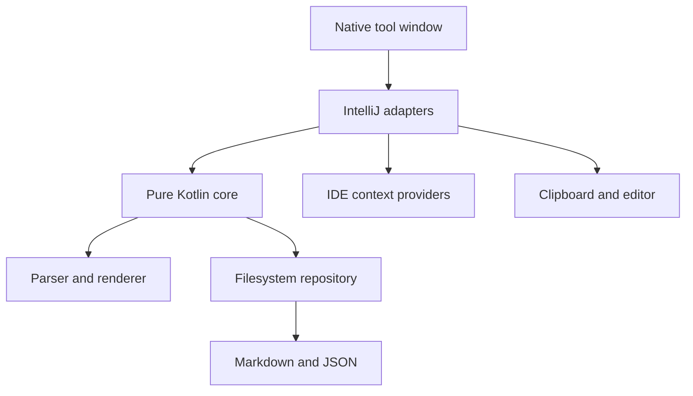

# Prompt Templates for JetBrains IDEs

A native JetBrains workbench for reusable, typed prompt templates. Templates are ordinary Markdown files containing `{{variables}}`; input types and library metadata live in a separate JSON sidecar.

The plugin is agent-agnostic. It renders exact text, copies it to the clipboard, or inserts it into the active editor. It does not make network requests, execute prompts, or depend on private AI Assistant or Junie APIs.

## Current development state

`0.1.1` is the latest released functional beta for standalone JetBrains IDEs based on IntelliJ Platform, with minimum build 262 (2026.2). The workflows below describe the current source tree for unreleased `0.2.0`. The explicit verification matrix covers RustRover 2026.2 and WebStorm 2026.2; other compatible products are intended targets but have not yet been individually verified.

Implemented workflows:

- Search a personal prompt library by metadata and body text.
- Organise templates in nested folders with saved manual ordering.
- Move and reorder folders or templates with drag-and-drop or keyboard actions.
- Use focused root, folder and template context menus for common library actions.
- Create and edit templates inside a native tool window.
- Discover and highlight `{{variable}}` placeholders while typing.
- Configure Text, Multiline and Enum variables.
- Resolve `ide.selection`, current-file, project and clipboard context.
- Validate required values and show an exact, whitespace-preserving preview.
- Copy a rendered prompt or insert it into the active editor as one undoable command.
- Open, reveal and copy the path of canonical Markdown.
- Import standalone Markdown and export template or rendered Markdown.
- Recover Markdown whose sidecar is missing and diagnose broken templates.
- Switch between wide master-detail and narrow card layouts.

Bundle import/export, project-local libraries, global Markdown annotations, terminal delivery and direct agent-window insertion remain intentionally outside the current scope.

## Storage format

The default library is `~/Prompt Templates`, configurable under **Settings | Tools | Prompt Templates**.

```text
Prompt Templates/
  .prompt-templates-order.json
  Reviews/
    .prompt-templates-order.json
    Security/
      review-implementation/
        prompt.md
        prompt.meta.json
```

A directory that contains `prompt.md` or `prompt.meta.json` is a template package and a leaf in the library tree. Other directories are organiser folders. The plugin ignores `.git`, `.hg`, `.svn` and `.idea` management directories, and its own `.prompt-template-delete-*` and `.prompt-template-rename-*` working directories. A working directory that a failed operation leaves behind is named in the error message and is not shown in the library. The optional `.prompt-templates-order.json` file in each organiser folder records manual order; folders without it use alphabetical order. Template UUIDs and schema stay independent of folder location.

`prompt.md` remains portable:

```md
Review the selected implementation.

Objective: {{objective}}
Depth: {{review_depth}}

{{ide.selection}}
```

`prompt.meta.json` stores the typed form schema:

```json
{
  "schemaVersion": 1,
  "id": "d43f3d91-6729-4fb0-bf09-f52c8ce11e59",
  "name": "Review implementation",
  "description": "Review code for correctness and maintainability.",
  "tags": ["review", "code"],
  "variables": [
    {
      "key": "objective",
      "label": "Objective",
      "type": "multiline",
      "required": true,
      "options": []
    }
  ]
}
```

Metadata is serialized deterministically. Unknown fields are tolerated; a future unsupported schema is opened as an error and is never silently migrated or overwritten.

## Build and run

Requirements are JDK 25 and the included Gradle wrapper. Gradle can provision the matching toolchain automatically.

```bash
./gradlew check
./gradlew :plugin:buildPlugin
./gradlew :plugin:runIde
./gradlew :plugin:integrationTest
```

The installable ZIP is written to `plugin/build/distributions/`. Install it with **Settings | Plugins | ⚙ | Install Plugin from Disk…**.

The integration task is a local E2E check. It installs the built plugin into an isolated unified IntelliJ IDEA 2026.2.0.1 instance, uses a temporary project and user home, and drives the real Swing UI with JetBrains Starter and Driver. Screenshots, Swing hierarchies, tree state, isolated paths and library manifests are written below `plugin/build/ui-test/`. On headless Linux, run the task under Xvfb. Local desktop sessions can use their native display.

Install [`gh-signoff`](https://github.com/basecamp/gh-signoff) once:

```bash
gh extension install basecamp/gh-signoff
```

Run the E2E task before you sign off the current commit:

```bash
./gradlew :plugin:integrationTest
gh signoff e2e
```

Run `gh signoff e2e` only after the E2E task passes. If it fails, report the result with `gh signoff fail e2e --description "local E2E failed"`. The `signoff/e2e` status is required on pull requests to `main`.

The core module has no IntelliJ dependency, so its parser, renderer, codec and repository tests run independently:

```bash
./gradlew :core:test
```

## Architecture



- `core/` owns immutable models, the linear scanner, strict renderer, deterministic JSON codec, reconciliation, search and safe filesystem repository.
- `plugin/` owns settings, native Swing/platform components, context resolution, output destinations, actions and the responsive tool window.
- Expected validation failures are typed diagnostics rather than exceptions.
- Files are written through same-directory temporary files and atomic replacement where the filesystem supports it.
- The configured library root can be a symbolic link. Managed entries inside it cannot be symbolic links, and repository traversal does not follow them.
- Folder deletion uses a fresh subtree preview, typed confirmation and a second fingerprint check before recursive removal. The fingerprint records entry names, sizes, modification times and file identities, not file contents.
- Expanded folders and the selected template are remembered per project in the workspace file.

The full product and implementation rationale is in [`docs/implementation-plan.md`](docs/implementation-plan.md).

## Privacy and security

The plugin has no networking, telemetry or prompt execution. Current variable values are kept only in memory for the IDE session. Prompt contents and entered values are not logged. Clipboard, editor insertion, imports and exports happen only after explicit user actions.

## Compatibility and release work

The plugin declares only the shared `com.intellij.modules.platform` dependency. Product compatibility therefore covers standalone JetBrains IDEs that provide that module, with minimum platform build 262. It does not depend on a product-specific language or framework module.

CI compiles, tests and builds the plugin ZIP on JDK 25, then runs Plugin Verifier against RustRover 2026.2 and WebStorm 2026.2. The slower IntelliJ IDEA Starter/Driver E2E suite is a local check. Those verified hosts are not a product whitelist. Before a public 1.0 release, the verifier and manual UI matrix should expand across representative compatible products. Remote-development topology remains a separate, unverified target.

## License

Prompt Templates is available under the [Apache License 2.0](LICENSE).

## Attribution

[Copy-and-paste icons created by ranksol graphics - Flaticon](https://www.flaticon.com/free-icons/copy-and-paste)
