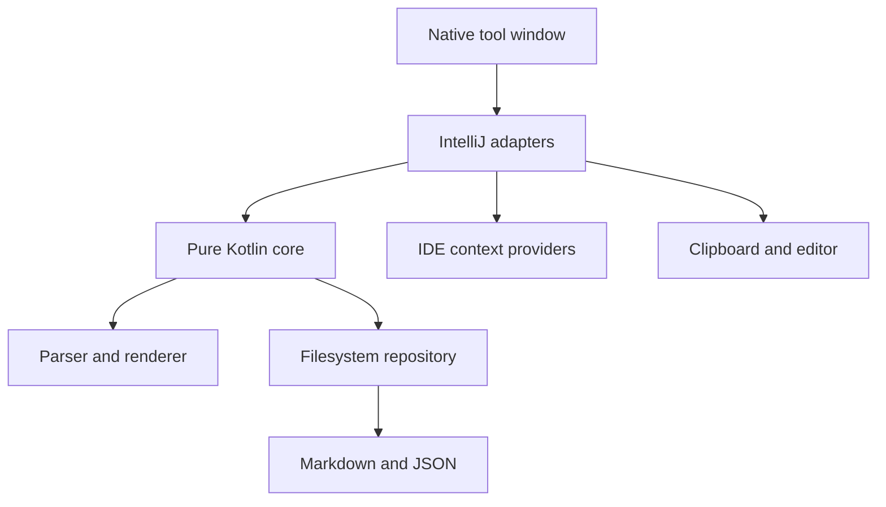

# Prompt Templates for JetBrains IDEs

A native JetBrains workbench for reusable, typed prompt templates. Templates are ordinary Markdown files containing `{{variables}}`; input types and library metadata live in a separate JSON sidecar.

The plugin is agent-agnostic. It renders exact text, copies it to the clipboard, or inserts it into the active editor. It does not make network requests, execute prompts, or depend on private AI Assistant or Junie APIs.

## Current release

`0.1.0` is a functional beta targeting IntelliJ Platform 2026.2 (build 262). The supported hosts are RustRover 2026.2 and WebStorm 2026.2.

Implemented workflows:

- Search a personal prompt library by metadata and body text.
- Create and edit templates inside a native tool window.
- Discover and highlight `{{variable}}` placeholders while typing.
- Configure Text, Multiline and Enum variables.
- Resolve `ide.selection`, current-file, project and clipboard context.
- Validate required values and show an exact, whitespace-preserving preview.
- Copy a rendered prompt or insert it into the active editor as one undoable command.
- Open, reveal and copy the path of canonical Markdown.
- Import standalone Markdown and export template or rendered Markdown.
- Recover Markdown whose sidecar is missing and diagnose broken templates.
- Switch between wide master-detail and narrow card layouts.

Bundle import/export, project-local libraries, global Markdown annotations, terminal delivery and direct agent-window insertion remain intentionally outside this release.

## Storage format

The default library is `~/Prompt Templates`, configurable under **Settings | Tools | Prompt Templates**.

```text
Prompt Templates/
  review-implementation/
    prompt.md
    prompt.meta.json
```

`prompt.md` remains portable:

```md
Review the selected implementation.

Objective: {{objective}}
Depth: {{review_depth}}

{{ide.selection}}
```

`prompt.meta.json` stores the typed form schema:

```json
{
  "schemaVersion": 1,
  "id": "d43f3d91-6729-4fb0-bf09-f52c8ce11e59",
  "name": "Review implementation",
  "description": "Review code for correctness and maintainability.",
  "tags": ["review", "code"],
  "variables": [
    {
      "key": "objective",
      "label": "Objective",
      "type": "multiline",
      "required": true,
      "options": []
    }
  ]
}
```

Metadata is serialized deterministically. Unknown fields are tolerated; a future unsupported schema is opened as an error and is never silently migrated or overwritten.

## Build and run

Requirements are JDK 25 and the included Gradle wrapper. Gradle can provision the matching toolchain automatically.

```bash
./gradlew check
./gradlew :plugin:buildPlugin
./gradlew :plugin:runIde
```

The installable ZIP is written to `plugin/build/distributions/`. Install it with **Settings | Plugins | ⚙ | Install Plugin from Disk…**.

The core module has no IntelliJ dependency, so its parser, renderer, codec and repository tests run independently:

```bash
./gradlew :core:test
```

## Architecture



- `core/` owns immutable models, the linear scanner, strict renderer, deterministic JSON codec, reconciliation, search and safe filesystem repository.
- `plugin/` owns settings, native Swing/platform components, context resolution, output destinations, actions and the responsive tool window.
- Expected validation failures are typed diagnostics rather than exceptions.
- Files are written through same-directory temporary files and atomic replacement where the filesystem supports it.
- Template deletion is restricted to a non-symlink direct child of the configured library root.

The full product and implementation rationale is in [`docs/implementation-plan.md`](docs/implementation-plan.md).

## Privacy and security

The plugin has no networking, telemetry or prompt execution. Current variable values are kept only in memory for the IDE session. Prompt contents and entered values are not logged. Clipboard, editor insertion, imports and exports happen only after explicit user actions.

## Compatibility and release work

CI compiles, tests and builds the plugin ZIP on JDK 25, then verifies it against RustRover 2026.2 and WebStorm 2026.2. Earlier platform builds and other IDE products are outside the supported scope. Before a public 1.0 release, the distribution still needs manual UI review in both supported hosts.

## License

Prompt Templates is available under the [Apache License 2.0](LICENSE).

## Attribution

[Copy-and-paste icons created by ranksol graphics - Flaticon](https://www.flaticon.com/free-icons/copy-and-paste)
