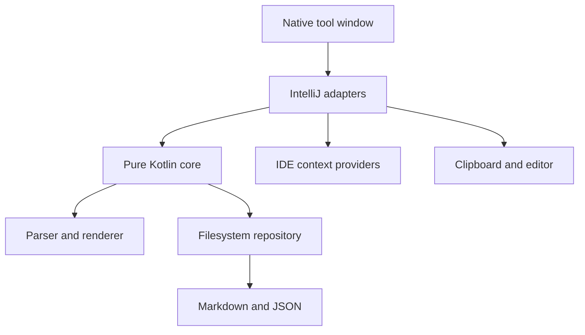

# Prompt Templates for JetBrains IDEs

A native JetBrains workbench for reusable, typed prompt templates. Templates are ordinary Markdown files containing `{{variables}}`; input types and library metadata live in a separate JSON sidecar.

The plugin is agent-agnostic. It renders exact text, copies it to the clipboard, or inserts it into an explicitly identified editor target. It does not make network requests, execute prompts, or depend on private AI Assistant or Junie APIs.

## Release and development status

`0.3.0` is the latest functional beta for standalone JetBrains IDEs based on IntelliJ Platform, with minimum build 262 (2026.2). The explicit verification matrix covers RustRover 2026.2 and WebStorm 2026.2; other compatible products are intended targets but have not yet been individually verified.

The workflows below are included in `0.3.0`. The [completed invocation and authoring roadmap](docs/roadmap.md) records the changes since `0.2.0`.

Implemented workflows:

- Search a personal prompt library by metadata and body text.
- Invoke Quick Use from the editor, with ranked search, favourites and recent templates.
- Organise templates in nested folders with saved manual ordering.
- Move and reorder folders or templates with drag-and-drop or keyboard actions.
- Use focused root, folder and template context menus for common library actions.
- Create and edit templates inside a native tool window.
- Duplicate authored templates or create a draft from an editor selection.
- Discover and highlight `{{variable}}` placeholders while typing.
- Configure Text, Multiline and Enum variables.
- Resolve `ide.selection`, current-file, project and clipboard context.
- Attach selected file buffers or explicit Git diffs to the frozen preview.
- Validate required values and show an exact, whitespace-preserving preview.
- Copy the inspected prompt or insert it into the labelled editor target as one undoable command.
- Capture only referenced IDE/clipboard context, then retain that snapshot until explicit refresh.
- Open, reveal and copy the path of canonical Markdown.
- Import standalone Markdown and export template or rendered Markdown.
- Recover Markdown whose sidecar is missing and diagnose broken templates.
- Switch between wide master-detail and narrow card layouts.

Bundle import/export, project-local libraries, global Markdown annotations, terminal delivery and direct agent-window insertion remain intentionally outside the current scope.

### Quick Use

Run **Use Prompt Template…** from Find Action, Tools, or the editor context menu. You can bind `PromptTemplates.Use` in the IDE keymap; it has no default global shortcut. Quick Use works before the tool window opens.

Type to search. Up and Down select a row; Enter opens its form and exact preview. Selection does not copy or insert, including templates without inputs. Complete the inputs, inspect the preview, then use **Copy Prompt**. The dialog provides native mnemonics for **Favourite** and **Copy Prompt**. Escape closes it and returns focus to the invoking editor. **Open in Tool Window** continues with the same captured context and entered values.

Empty search puts favourites and recents first, followed by the remaining library. Explicit searches rank exact names, name prefixes, other name matches, tags/folder paths, then descriptions/body text. Text relevance comes before favourite/recent ordering. Each row shows its folder path and input/context counts.

Favourites and the last 20 successful template deliveries are local IDE settings, scoped to the library directory and keyed by UUID. Rename and move preserve identity. Missing entries are ignored. This state stores only library paths, template identities and ordering; it contains no prompt text, captured context or input values.

### File and Git context

Add `{{ide.attachments}}` where context belongs in the template, using the author variable chooser. In Use, choose **File | Add Context…**; Quick Use has an **Add Context…** button. Capture **Current File**, **Selected Files…**, or an explicit **Git Diff…**. Inspect the captured text and provenance, then choose **Apply Attachments**. Cancel retains the existing invocation.

Local open files use editor-buffer text, including unsaved edits. Remote and virtual-only sources are unsupported. Other files use on-disk text. Each item shows its source, capture time and size. Items retain addition order; a multi-file selection is sorted by full path. Repeated captures replace the same source in place. **Refresh Selected** captures that source again; **Remove** removes its complete block. Normal **Refresh Context** and Reset do not refresh attachments. Opening/reloading a template or switching libraries clears them; Quick Use handoff retains them.

The limits are 16 items, 256 KiB of UTF-8 text per item, and 1 MiB total, with a 1 MiB encoded-file read limit. Missing, binary, unreadable or oversized sources fail visibly. No content is truncated. Empty files are valid. Attachment text, including placeholder syntax, stays literal inside labelled Markdown blocks. Preview and all output use the same frozen payload.

Git capture requires the optional Git plugin and its configured executable. Choose the repository and **Staged: HEAD → index** or **Unstaged: index → working tree**. The captured HEAD and scope are shown. Diffs include tracked on-disk changes; unsaved buffers and untracked files must be attached separately. Binary/submodule changes, repositories without a HEAD commit and unsupported UTF-8 output are rejected. Capture uses fixed local read operations with external content-processing helpers disabled. It opens no terminal and makes no network request. See the [implementation design](docs/context-attachments.md) for the capability boundaries.

### Duplicate and capture

Choose **Duplicate Template…** in a template's context menu or its **File** menu, then choose a destination folder. The author draft has a new UUID and an available suggested name. It retains the source Markdown, schema, tags and authored defaults. Current input values and captured context are not copied into defaults. Only **Save Template** writes the new package; Cancel leaves the source unchanged.

Run **Create Template from Selection…** from Find Action or the editor context menu. You can bind `PromptTemplates.CreateFromSelection` in the keymap. It captures the selected text before opening the author view. With no selection, it asks you to select text. If the selection contains `{{`, choose **Preserve Literally** (the default) or **Interpret Placeholders**. Literal capture escapes each opening so rendering restores the original text, including existing backslashes. Interpretation uses the normal placeholder and variable rules. Save validates the name and destination through the normal creation path. Finish or cancel an open author draft before starting another.

### Context and output

**Browse Examples…** in the empty state or **New | Browse Examples…** offers three optional [worked examples](docs/worked-examples.md). Inspect mock inputs and expected output before **Add Example** creates an editable copy. Nothing is installed automatically; New Template and Import remain available.

Selecting a template captures the context it references. Copy, Insert and rendered export use exactly the validated preview; copying a clipboard-based prompt twice does not add the previous output to the next copy.

**File | Open Rendered Prompt as Scratch Markdown** exports that validated preview to a new local `.md` scratch file and opens its text editor. This is an explicit local export: the IDE retains scratch files outside the template library, and they can contain captured context or entered values. Each use creates a separate file. Editing it does not change the template or the current invocation. Markdown support is used when available; otherwise the scratch opens as plain text. Preview updates never create scratch files.

The Use form shows referenced user variables in their authored order. Repeated placeholders share one field. Escaped placeholders and IDE/clipboard references do not create user fields. Unused definitions remain in the author inspector. If a required value is missing, delivery focuses its input and scrolls it into view, including multiline text areas.

The **File** menu contains **Refresh Context**, **Reload Template**, **Use Active Editor as Insertion Target** and **Reset Values to Defaults**. Refresh explicitly captures context from the currently selected editor and clipboard. Reset restores authored defaults without reading context again. The preview reports requested context availability and source paths/selection lines.

Insert retains the editor and range selected when the invocation began. Changing editor focus does not retarget it. If that document or range changes, select the intended editor/range and use **Use Active Editor as Insertion Target** before inserting. Refreshing context does not change the insertion target.

An external template edit keeps the inspected preview visible and blocks delivery until **Reload Template**. Reload captures fresh context and retains entered values only for compatible variable types and enum choices. Moving a template preserves its invocation by UUID. Switching libraries clears invocation state while retaining the existing author-draft handling.

In the author view, **Cancel** closes a clean draft immediately. For changed Markdown or metadata, it offers **Discard** and **Keep Editing**, with Keep Editing selected by default. Reverting all editable inputs makes the draft clean again. Word wrap, hiding the tool window, and changing its layout do not discard the draft. Drafts remain in memory only.

Use **Template Markdown ▾ | Insert Variable…** to select an existing input or a supported IDE context value. Input selection focuses its inspector; context selection shows an explanation and creates no user field. The chooser inserts at the captured caret or selection and rejects positions inside an existing placeholder or after an escape character.

Select author text and choose **Extract as Variable…** to replace it with a new user placeholder. Enter a unique key, choose Text or Multiline, and explicitly check **Use selected text as authored default** to retain the exact selection. The default checkbox starts unchecked. Cancel changes nothing. Undo and Redo in the Markdown editor keep extraction and Rename definitions with their text, while retaining unrelated inspector edits. These actions apply only to the template author view; Save is still required to write the draft.

The variable inspector exposes authored Text/Multiline defaults, an Enum default option, input placeholders, help text and multiline minimum rows. **Use authored default** distinguishes an absent default from an explicitly empty value; empty required values still block delivery. Removing an enum choice selects a surviving default. **Move Up** and **Move Down** change metadata/form order without changing Markdown or rendered text. Existing field order survives reconciliation; new variables are appended.

Each Use field has **Reset**, and **File | Reset Values to Defaults** resets all user inputs. Both retain the captured context. Editing authored defaults does not replace retained session inputs; use Reset to apply them to the current invocation. Ordinary input values remain session-only.

At narrow widths, variable navigation moves above the author inspector. The inspector scrolls to controls as you move through them with Tab. Save and Cancel stay below the editor. The Use footer contains Copy Prompt, Insert and Edit; **Delete** is in the File menu and the library context menu, with confirmation before removal.

## Storage format

The default library is `~/Prompt Templates`, configurable under **Settings | Tools | Prompt Templates**.

```text
Prompt Templates/
  .prompt-templates-order.json
  Reviews/
    .prompt-templates-order.json
    Security/
      review-implementation/
        prompt.md
        prompt.meta.json
```

A directory that contains `prompt.md` or `prompt.meta.json` is a template package and a leaf in the library tree. Other directories are organiser folders. The plugin ignores `.git`, `.hg`, `.svn` and `.idea` management directories, and its own `.prompt-template-delete-*` and `.prompt-template-rename-*` working directories. A working directory that a failed operation leaves behind is named in the error message and is not shown in the library. The optional `.prompt-templates-order.json` file in each organiser folder records manual order; folders without it use alphabetical order. Template UUIDs and schema stay independent of folder location.

`prompt.md` remains portable:

```md
Review the selected implementation.

Objective: {{objective}}
Depth: {{review_depth}}

{{ide.selection}}
```

`prompt.meta.json` stores the typed form schema:

```json
{
  "schemaVersion": 1,
  "id": "d43f3d91-6729-4fb0-bf09-f52c8ce11e59",
  "name": "Review implementation",
  "description": "Review code for correctness and maintainability.",
  "tags": ["review", "code"],
  "variables": [
    {
      "key": "objective",
      "label": "Objective",
      "type": "multiline",
      "required": true,
      "options": []
    }
  ]
}
```

Metadata is serialized deterministically. Unknown fields are tolerated; a future unsupported schema is opened as an error and is never silently migrated or overwritten.

## Build and run

Requirements are JDK 25 and the included Gradle wrapper. Gradle can provision the matching toolchain automatically.

```bash
./gradlew check
./gradlew :plugin:buildPlugin
./gradlew :plugin:runIde
./gradlew :plugin:integrationTest
```

The installable ZIP is written to `plugin/build/distributions/`. Install it with **Settings | Plugins | ⚙ | Install Plugin from Disk…**.

The integration task is a local E2E check. It installs the built plugin into an isolated WebStorm 2026.2 instance (build `262.8665.259`), uses a temporary project and user home, and drives the real Swing UI with JetBrains Starter and Driver. Swing hierarchies, tree state, isolated paths and library manifests are written below `plugin/build/ui-test/`. A screenshot is also written when the display server supports capture; otherwise the directory contains a screenshot capture-error file. On headless Linux, run the task under Xvfb. Local desktop sessions can use their native display.

The suite includes a [500-template Quick Use benchmark](docs/quick-use-benchmark.md), with supported-host measurements and regression review targets.

For exploratory testing, select one E2E scenario and add `-Pexplore=true`. After its assertions finish, the isolated IDE remains open for up to five minutes, including when a check fails. The task prints the path of an `exploration-complete` marker; create that file when exploration is finished. Record observations separately and run the full suite normally before signing off.

Install [`gh-signoff`](https://github.com/basecamp/gh-signoff) once:

```bash
gh extension install basecamp/gh-signoff
```

Run the E2E task before you sign off the current commit:

```bash
./gradlew :plugin:integrationTest && gh signoff e2e
```

Run `gh signoff e2e` only after the E2E task passes. If it fails, report the result with `gh signoff fail e2e --description "local E2E failed"`. The `signoff/e2e` status is required on pull requests to `main`.

The core module has no IntelliJ dependency, so its parser, renderer, codec and repository tests run independently:

```bash
./gradlew :core:test
```

## Architecture



- `core/` owns immutable models, the linear scanner, strict renderer, deterministic JSON codec, reconciliation, search and safe filesystem repository.
- `plugin/` owns settings, native Swing/platform components, context resolution, output destinations, actions and the responsive tool window.
- Expected validation failures are typed diagnostics rather than exceptions.
- Template saves stage both contents in a save journal, then replace the canonical files atomically. Reopening completes an interrupted save only if both file fingerprints still match the recorded old or new versions. A later external edit leaves the journal intact and shows a recovery diagnostic.
- Repository updates check the loaded revision under a library file lock. Conflict review compares the disk version with the draft; overwrite checks that reviewed revision again. Separate IDE processes share the lock.
- The configured library root can be a symbolic link. Managed entries inside it cannot be symbolic links, and repository traversal does not follow them.
- Folder deletion uses a fresh subtree preview, typed confirmation and a second fingerprint check before recursive removal. The fingerprint records entry names, sizes, modification times and file identities, not file contents.
- Expanded folders and the selected template are remembered per project in the workspace file.

The full product and implementation rationale is in [`docs/implementation-plan.md`](docs/implementation-plan.md).

The library needs write access for its persistent `.prompt-templates.lock` file and recovery. Template saves require atomic file replacement. Do not delete the lock file while an IDE uses the library. `.prompt-template-save.json` and `.prompt-template-stage-*` are internal save files, not templates. Keep an unresolved journal and both canonical files for manual comparison; restore a recorded version before retrying recovery. An interrupted process can leave unused staging files, which can be removed after all IDEs have closed. These guarantees cover process interruption, not sudden power loss. External editors do not take the plugin lock; an edit between the final fingerprint check and file replacement remains outside its isolation guarantee.

## Privacy and security

The plugin has no networking, telemetry or prompt execution. Current variable values are kept only in memory for the IDE session. Prompt contents and entered values are not logged. Clipboard, editor insertion, imports and exports happen only after explicit user actions.

## Compatibility and release work

The plugin declares only the shared `com.intellij.modules.platform` dependency. Product compatibility therefore covers standalone JetBrains IDEs that provide that module, with minimum platform build 262. It does not depend on a product-specific language or framework module.

CI compiles, tests and builds the plugin ZIP on JDK 25, then runs Plugin Verifier against RustRover 2026.2 and WebStorm 2026.2. The slower WebStorm Starter/Driver E2E suite is a local check. Those verified hosts are not a product whitelist. Before a public 1.0 release, the verifier and manual UI matrix should expand across representative compatible products. Remote-development topology remains a separate, unverified target.

## License

Prompt Templates is available under the [Apache License 2.0](LICENSE).

## Attribution

[Copy-and-paste icons created by ranksol graphics - Flaticon](https://www.flaticon.com/free-icons/copy-and-paste)
