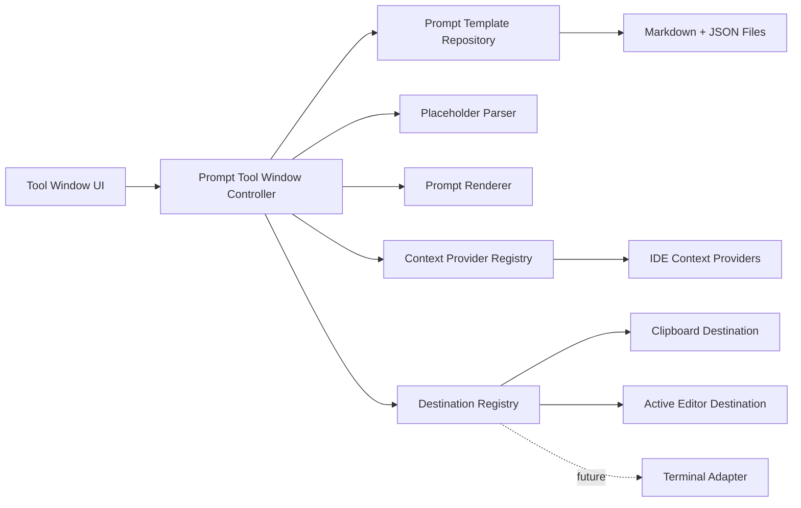

# JetBrains Prompt Templates Plugin — Full Implementation Plan

**Working product name:** Prompt Templates  
**Document status:** Original plan with later implementation notes\
**Prepared:** 3 August 2026  
**Primary platforms:** IntelliJ Platform-based desktop IDEs, including IntelliJ IDEA, WebStorm and RustRover  
**Primary language:** Kotlin  

The [invocation and authoring roadmap](roadmap.md) records the delivered scope of issues #3–#14. Other proposals and version-1.0 acceptance criteria in this plan are not implied complete by that delivery.

---

## 1. Executive summary

Build a native IntelliJ Platform plugin that provides a searchable library of reusable prompt templates for coding agents.

Templates are authored as ordinary Markdown files. Variables are written directly into the Markdown using `{{variable_name}}`. The plugin recognises those placeholders, highlights them inside an embedded JetBrains editor, and maintains a typed variable schema in a separate JSON sidecar file.

When a saved template is selected, the plugin generates a native form from that schema. Users fill in text, multiline and enum variables, inspect a live rendered preview, then copy the completed prompt, insert it into the selected editor target, or export it as Markdown.

The canonical Markdown file remains usable outside JetBrains. The typed metadata is never included in a normal Markdown export. A separate bundle export may include both files when round-trip sharing between plugin installations is required.

The first release should remain deliberately agent-agnostic. Clipboard output and active-editor insertion use stable public IntelliJ Platform APIs. Direct manipulation of JetBrains AI Assistant, Junie, terminal agent interfaces or arbitrary third-party tool windows is excluded from the first release because those surfaces either lack public insertion APIs or require unstable integrations.

---

## 2. Product definition

### 2.1 Core proposition

> A native, cross-IDE prompt-template workbench that combines portable Markdown templates with typed variables, generated forms, IDE context and reliable output actions.

### 2.2 Primary user value

The plugin should make reusable prompts:

- Faster to find and invoke than files in a directory.
- Safer to complete than manual search-and-replace.
- More expressive than untyped snippets.
- Portable outside JetBrains because the source remains ordinary Markdown.
- Consistent across WebStorm, RustRover and other IntelliJ Platform-based IDEs.
- Usable without opening or editing a source file in the main editor.

### 2.3 Terminology

Use **prompt template** throughout the product.

Do not call the object a **skill** in the UI. In current agent terminology, a skill usually implies a richer package containing instructions, tools, scripts or resources. This plugin initially manages typed text templates.

Key terms:

- **Template Markdown:** The canonical `prompt.md` file containing prompt text and placeholders.
- **Template metadata:** The sidecar `prompt.meta.json` file containing typed variable definitions and library metadata.
- **Template source:** The pair of files stored in the template directory.
- **Rendered prompt:** The final text after variable and context substitution.
- **Plain export:** Markdown-only export without metadata.
- **Bundle export:** Export containing Markdown and metadata for round-trip import.
- **User variable:** A value entered through the generated form.
- **Context variable:** A value supplied by the IDE or environment, such as the active selection.

---

## 3. Goals and non-goals

### 3.1 Goals for version 1.0

1. Run across IntelliJ Platform-based desktop IDEs without depending on product-specific language modules.
2. Present a native JetBrains tool-window interface using stable public APIs.
3. Store templates as real Markdown files on disk.
4. Store typed variable information in a separate JSON sidecar.
5. Support authoring templates entirely inside the plugin.
6. Recognise and highlight `{{variable}}` placeholders as users type.
7. Automatically discover new placeholders and create default variable definitions.
8. Support `text`, `multiline` and `enum` variable types.
9. Generate a native input form from the variable schema.
10. Render a live preview preserving exact whitespace.
11. Copy the rendered prompt to the clipboard.
12. Insert the rendered prompt into the selected editor target as one undoable operation.
13. Open, reveal and copy the path of the canonical Markdown file.
14. Export template Markdown without metadata.
15. Export a rendered prompt as Markdown.
16. Import a standalone Markdown template and infer untyped variables.
17. Validate compatibility in representative IntelliJ Platform IDEs before each release and expand the product matrix before 1.0.
18. Avoid network access, telemetry and arbitrary code execution.

### 3.2 Explicit non-goals for version 1.0

- Direct insertion into JetBrains AI Assistant or Junie.
- Direct insertion into arbitrary third-party agent windows.
- Terminal insertion or automatic terminal execution.
- A full programming language with loops, expressions or functions.
- Conditional template blocks.
- Boolean variables unless explicit checked and unchecked rendered values are designed.
- Remote team synchronisation or a hosted template service.
- Marketplace template packs.
- Prompt execution through an LLM API.
- Token estimation.
- Markdown rendering through an embedded browser.
- A React, Compose or JCEF-based application embedded inside the IDE.
- Global modification of ordinary Markdown editing behaviour.

---

## 4. Recommended product decisions

These defaults remove ambiguity from the implementation.

| Decision | Recommendation |
|---|---|
| Tool-window name | `Prompt Templates` |
| Tool-window default anchor | Bottom |
| Primary output action | `Copy Prompt` |
| Canonical template body | `prompt.md` |
| Sidecar metadata | `prompt.meta.json` |
| Template identity | UUID stored in metadata |
| Template directory | One directory per template |
| Placeholder syntax | `{{variable_name}}` |
| Variable key grammar | `[A-Za-z_][A-Za-z0-9_-]*` |
| Reserved context namespace | Dotted keys such as `ide.selection` |
| Escape syntax | `\{{` for a literal `{{` |
| Initial variable types | Text, Multiline, Enum |
| Optional empty values | Render as an empty string |
| Missing required values | Block copy, insertion and rendered export |
| Template save behaviour | Explicit `Save Template` action |
| Input-value persistence | Session-only by default |
| Metadata format | Versioned JSON |
| First-release scope | Personal library; project libraries follow |
| Supported IDE baseline | IntelliJ Platform 2026.2 (build 262) |
| Mandatory platform dependency | `com.intellij.modules.platform` |
| UI framework | Swing with JetBrains platform components |
| Settings/forms framework | Kotlin UI DSL v2 where appropriate |
| Build tooling | IntelliJ Platform Gradle Plugin 2.x |

The minimum supported IntelliJ Platform is 2026.2 (build 262). Because the plugin depends only on `com.intellij.modules.platform`, its product scope is all standalone JetBrains IDEs that provide that shared module. The current beta verification matrix covers RustRover 2026.2 and WebStorm 2026.2; other compatible products are intended targets but have not yet been individually verified. Remote-development topology remains a separate target.

Use **compatible products** for products admitted by the descriptor dependencies and platform build range. Use **verified hosts** only for products checked by Plugin Verifier or explicit runtime testing. Do not use these terms interchangeably.

---

## 5. User journeys

### 5.1 Find and use an existing template

1. Open the `Prompt Templates` tool window.
2. Focus lands in the search field.
3. The nested library tree restores its saved expansion and selection state.
4. Type part of a template name, description, tag or body text.
5. Select a template.
6. The right-hand pane displays generated fields for its user variables.
7. Context variables are resolved or show an explicit unavailable state.
8. The live preview updates as values change.
9. Press `Copy Prompt`, `Insert…`, or `Export Rendered Markdown…`.
10. A non-modal confirmation reports the result.

### 5.2 Create a new template

1. Press `New Template`.
2. Enter a name, optional description and tags.
3. Type the prompt directly into the embedded editor.
4. Type `{{objective}}`.
5. The placeholder is highlighted and `objective` appears in the Variables panel as a required Text variable.
6. Select `objective` and change its type to Multiline.
7. Type `{{review_depth}}`.
8. Change its type to Enum and define options.
9. Add `{{ide.selection}}`; the plugin recognises it as a built-in context variable rather than a user field.
10. Press `Save Template`.
11. The plugin creates the template directory, Markdown file and sidecar metadata.
12. The template opens in use mode.

### 5.3 Export portable Markdown

1. Select a template.
2. Choose `Export Template Markdown…`.
3. Select a destination.
4. The plugin copies only `prompt.md`, retaining `{{variables}}`.
5. The exported file is valid ordinary Markdown and contains no plugin metadata.
6. A notification offers `Open File` and `Reveal`.

### 5.4 Locate and reuse the canonical source

1. Select a template.
2. Use `Open Markdown`, `Reveal Source`, or `Copy Markdown Path`.
3. The canonical file can be edited, copied, committed or used outside the plugin.

### 5.5 Import standalone Markdown

1. Choose `Import Markdown…`.
2. Select a `.md` file.
3. The plugin derives the initial name from the first H1 or filename.
4. It discovers all valid placeholders.
5. User variables are initially created as required Text variables.
6. Known context variables are identified automatically.
7. The import screen permits metadata adjustment before saving.

---

## 6. Information architecture and layout

The UI has three conceptual workflows:

1. **Library:** Search, select, organise, import and inspect source location.
2. **Author:** Edit Markdown and configure typed variables.
3. **Use:** Enter values, preview the rendered prompt and deliver it.

Do not combine all three into one permanently dense screen.

### 6.1 Wide layout

Use a bottom-anchored master-detail layout when enough width is available.

```text
┌ Prompt Templates ───────────────────────────────────────────────────┐
│ [ Search templates…                         ] [+ New] [Import] [⋮] │
├────────────────────┬────────────────────────────────────────────────┤
│ ▾ Reviews          │ Review implementation                          │
│   ▾ Security       │ ~/Prompt Templates/Reviews/Security/…          │
│     Review impl…   │                                                │
│   Review change    │ Objective                                      │
│ ▸ Ideas            │ [ Review correctness and edge cases         ] │
│ Diagnose failure   │                                                │
│                    │ Review depth                                   │
│                    │ [ Thorough                                  ▾ ]│
│                    │                                                │
│                    │ Additional context                             │
│                    │ [                                            ] │
│                    │ [                                            ] │
│                    │                                                │
│                    │ ▾ Preview                                      │
│                    │ ┌────────────────────────────────────────────┐ │
│                    │ │ Review the following implementation…      │ │
│                    │ └────────────────────────────────────────────┘ │
│                    │                                                │
│                    │ [Copy Prompt] [Insert…] [Export…] [Edit]      │
└────────────────────┴────────────────────────────────────────────────┘
```

The library pane uses a native tree. It shows organiser folders before template leaves. Users can create, rename, move, manually reorder, expand and collapse entries through matching pointer and keyboard actions. Root, folder and template context menus expose only valid actions for their target.

### 6.2 Narrow layout

When the tool window is moved to the right or becomes narrower than the defined breakpoint, switch to a card-based layout rather than compressing the master-detail interface.

The author variable list and inspector also adapt to their available width. Below a scaled 560-pixel width, the list sits above the scrollable inspector. Resizing retains the same fields, selection and draft. Keyboard focus scrolls each inspector control into view. Save and Cancel remain outside that scrolling area; wrapped diagnostics have their own bounded scroll area. The Use footer contains Copy Prompt, Insert and Edit. Delete remains available through the File and library context menus with its existing confirmation.

Use forms include only authored definitions referenced by user-variable tokens, in metadata order. Repeated tokens share a field; escaped openings and context tokens create none. Unused definitions remain available to the author. Labels and validation target the actual input, including the text area inside a multiline scroll pane. Keyboard focus scrolls that input's layout component into view.

```text
┌ Prompt Templates ─────────────┐
│ ‹ Library          Edit  ⋮    │
│ Review implementation         │
│                               │
│ Objective                     │
│ [                           ] │
│                               │
│ Review depth                  │
│ [ Thorough                 ▾ ]│
│                               │
│ Additional context            │
│ [                           ] │
│ [                           ] │
│                               │
│ ▸ Preview                     │
│                               │
│ [Copy Prompt]     [Insert…]   │
└───────────────────────────────┘
```

Recommended implementation:

- Listen to component resize events.
- Use a tested width threshold rather than querying tool-window anchor alone.
- Preserve selected template and form state when switching layouts.
- Store splitter proportions and last layout state as lightweight UI preferences.

### 6.3 Authoring layout

```text
┌ Edit: Review implementation ────────────────────────────────────────┐
│ Name: [ Review implementation                                   ] │
│ Tags: [ review, code-quality                                    ] │
│ Description: [ Review code for correctness and maintainability  ] │
│                                                                    │
│ Template Markdown                                      [✓ Word wrap]│
│ ┌────────────────────────────────────────────────────────────────┐ │
│ │ Review the following implementation.                           │ │
│ │                                                                │ │
│ │ Objective: {{objective}}                                       │ │
│ │ Review depth: {{review_depth}}                                 │ │
│ │                                                                │ │
│ │ Code:                                                          │ │
│ │ {{ide.selection}}                                              │ │
│ └────────────────────────────────────────────────────────────────┘ │
│                                                                    │
├ Variables ─────────────────────────────────────────────────────────┤
│ objective       Multiline     Required                             │
│ review_depth    Enum          Required                             │
│ ide.selection   IDE context   Automatic                            │
│                                                                    │
│ Selected variable                                                  │
│ Label:       [ Review depth                                     ] │
│ Type:        [ Enum                                             ▾ ]│
│ Required:    [✓]                                                   │
│ Description: [ Controls how comprehensive the review should be  ] │
│ Options:     [ Quick ] [ Normal ] [ Thorough ]        [+] [-] [↕] │
│                                                                    │
│                                      [Cancel] [Save Template]       │
└────────────────────────────────────────────────────────────────────┘
```

The authoring editor exposes a word-wrap toggle. Soft wrapping is enabled by default and changes immediately without modifying the Markdown source. Native editor scrollbars appear when the Markdown exceeds the available viewport.

### 6.4 Empty state

The empty state must provide a direct next action.

```text
No prompt templates yet.

Create a typed template here or import an existing Markdown file.

[New Template] [Import Markdown…]
```

Do not show an empty blank list or require the user to discover toolbar icons.

### 6.5 Layout alternatives considered

| Layout concept | Strengths | Weaknesses | Decision |
|---|---|---|---|
| Bottom master-detail workbench | Enough width for library, generated form, authoring editor and preview; matches JetBrains guidance for wide content | Uses vertical editor space | Default layout |
| Right-side assistant panel | Familiar location for AI-adjacent tools; remains visible beside code | Too narrow for simultaneous library, form and authoring controls | Supported through responsive narrow mode |
| Editor-first workflow | Maximum Markdown editing capability; source is always explicit | Splits the normal workflow across editor tabs and tool window; less approachable for quick use | Offer `Open Markdown`, but do not make this the primary workflow |
| Search popup or chooser | Keyboard invocation with ranked search and local favourites/recents | Limited room for complex multiline inputs and authoring | Quick Use provides a form and preview, with exact-session handoff to the tool window |
| Modal wizard | Simple linear implementation | Blocks the IDE and makes repeated prompt use cumbersome | Reject |
| JCEF web application | Flexible HTML layout | Inconsistent with native IDE behaviour; larger accessibility, lifecycle and theme burden | Reject for the main UI |

The implementation should therefore expose one product through two adaptive presentations: a bottom master-detail workbench and a narrow card-based assistant view. A future searchable popup should reuse the same repository, rendering and destination services rather than introducing a separate model.

---

## 7. Design language

### 7.1 Native appearance

The plugin should look like a first-party JetBrains feature:

- Use platform components rather than bespoke controls.
- Use theme-derived colours and borders.
- Use `JBUI` scaling utilities rather than fixed pixel assumptions.
- Support compact mode, high-DPI scaling and all bundled themes.
- Use monochrome SVG icons following JetBrains icon sizing rules.
- Avoid custom shadows, branded cards, web-style pills and arbitrary corner radii.
- Use ordinary labelled buttons for dominant commands.
- Use toolbar icons for list-management operations.

### 7.2 Progressive disclosure

The default selected-template screen contains only what is needed to render and deliver a prompt.

Variable metadata, enum-option editing, file paths and destructive actions appear only in edit or overflow contexts.

### 7.3 Action hierarchy

- Primary: `Copy Prompt`.
- Secondary: `Insert…`, `Preview`, `Edit`.
- Tertiary: source and export actions.
- Destructive: `Delete Template`, isolated in an overflow menu or management toolbar.

A native split button may be used for related output destinations only if a stable public API is available for the minimum target platform. Otherwise use separate `Copy Prompt` and `Insert…` buttons. Do not depend on an internal split-button implementation merely to reproduce the visual pattern.

### 7.4 Keyboard operation

The complete use flow must work without a mouse:

1. Open the tool window through an action.
2. Search templates.
3. Select a result.
4. Tab through generated variables.
5. Open enum controls.
6. Toggle preview.
7. Copy or insert the rendered prompt.

All reusable commands should be represented by the IntelliJ Action System so users can assign shortcuts.

### 7.5 Accessibility

- Every input has a visible label and correct `labelFor` relationship.
- Set accessible names and descriptions for custom components.
- Status is never conveyed only by colour.
- Error text is readable by assistive technology.
- Focus order follows visual order.
- Tooltips supplement rather than replace visible labels.
- UI integration tests locate important controls by accessible name where possible.

---

## 8. Template storage model

### 8.1 Canonical directory structure

Use one directory per template.

```text
prompt-library/
  .prompt-templates-order.json
  Reviews/
    Security/
      review-implementation/
        prompt.md
        prompt.meta.json
```

Reasons:

- File pairing is unambiguous.
- Renaming a template does not risk separating similarly named files.
- A template can later contain examples or supporting resources.
- The directory can be copied or committed as one unit.
- The Markdown remains independently useful.

A directory containing either canonical template path is a template package and a leaf. A directory containing neither canonical path is an organiser folder. Scan recursively without following symbolic links, and exclude `.git`, `.hg`, `.svn` and `.idea` management directories. Existing top-level libraries need no migration.

Each organiser folder can contain `.prompt-templates-order.json`. It stores child directory segments in separate folder and template arrays. Folders remain before templates, with manual order inside each group. Missing order files use alphabetical order. Invalid files must not hide library content.

### 8.2 Markdown file

`prompt.md` is ordinary Markdown and is the canonical prompt body.

```md
Review the following implementation.

Objective: {{objective}}
Review depth: {{review_depth}}

Selected code:

{{ide.selection}}
```

The Markdown file must not contain type declarations, plugin IDs or other metadata.

### 8.3 Metadata file

`prompt.meta.json` contains the schema that cannot be represented cleanly in portable Markdown.

```json
{
  "schemaVersion": 1,
  "id": "d43f3d91-6729-4fb0-bf09-f52c8ce11e59",
  "name": "Review implementation",
  "description": "Review code for correctness and maintainability.",
  "tags": ["review", "code"],
  "variables": [
    {
      "key": "objective",
      "label": "Objective",
      "type": "multiline",
      "required": true,
      "description": "The principal objective of the review."
    },
    {
      "key": "review_depth",
      "label": "Review depth",
      "type": "enum",
      "required": true,
      "defaultValue": "thorough",
      "options": [
        {
          "id": "quick",
          "label": "Quick",
          "value": "Perform a concise review focused on serious defects."
        },
        {
          "id": "thorough",
          "label": "Thorough",
          "value": "Perform a comprehensive review including edge cases, failure modes and compatibility concerns."
        }
      ]
    }
  ]
}
```

### 8.4 Metadata rules

- `schemaVersion` is mandatory.
- `id` is a UUID and is the stable identity.
- Directory names and display names are not identity.
- `name` is mandatory and may change.
- Tags are case-insensitive for search but preserve entered casing for display.
- Variables are ordered; their array order controls form order.
- Context variables are not normally stored in `variables`; they are derived from the body and provider registry.
- Timestamps should not be written to metadata unless a future feature requires them. File modification times and application-level recent-use state avoid noisy version-control diffs.
- Unknown fields must be ignored when reading to permit forward compatibility.
- A newer unsupported `schemaVersion` must produce a clear read-only error rather than destructive migration.

### 8.5 Library location

Store the configured personal library path in application-level plugin settings.

Recommended first-run behaviour:

1. Propose a visible, cross-IDE user directory such as `~/Prompt Templates`.
2. Allow changing it before the first template is created.
3. Create the directory only after an explicit create or import operation.
4. Show the configured path in Settings.

Avoid an IDE-product-specific configuration directory as the sole default because that would create separate libraries for WebStorm, RustRover and IntelliJ IDEA.

### 8.6 Repository resilience

The repository must tolerate:

- Missing metadata.
- Invalid metadata.
- Missing Markdown.
- Duplicate UUIDs.
- External file edits.
- Template directories copied outside the plugin.
- Unsupported metadata versions.

Recovery behaviour:

- Markdown without metadata is importable and recoverable.
- Missing metadata can be regenerated from discovered placeholders.
- Invalid metadata is never silently overwritten.
- Duplicate UUIDs are reported and can be repaired by assigning a new ID to one template.
- A broken template remains visible with a diagnostic status rather than disappearing.

---

## 9. Variable language

### 9.1 Placeholder grammar

User variable:

```text
{{objective}}
```

Context variable:

```text
{{ide.selection}}
```

Literal opening braces:

```text
\{{not_a_variable}}
```

Recommended grammar:

```ebnf
template          = { text | escaped_open | placeholder } ;
escaped_open      = "\\{{" ;
placeholder       = "{{", optional_space, identifier, optional_space, "}}" ;
identifier        = segment, { ".", segment } ;
segment           = ( letter | "_" ), { letter | digit | "_" | "-" } ;
optional_space    = { " " | "\t" } ;
```

Canonical insertion should omit spaces, but the parser may accept `{{ objective }}`.

### 9.2 Reserved namespaces

Reserve dotted identifiers for context providers.

Initial built-ins:

```text
{{ide.selection}}
{{ide.file.name}}
{{ide.file.path}}
{{ide.file.relativePath}}
{{ide.language}}
{{ide.project.name}}
{{clipboard}}
```

`clipboard` may remain a top-level reserved key for ergonomics. All future provider families should use a namespace.

### 9.3 Variable discovery

After each document change:

1. Parse the full template body using a linear scanner.
2. Produce placeholder tokens and syntax diagnostics.
3. Deduplicate references by key.
4. Reconcile user-variable references with the draft metadata.
5. Add newly discovered user variables as required Text variables that are transient for the edit session.
6. Delete transient variables immediately when their references disappear or change.
7. Make a transient variable intentional when the user edits its key, label, type, required state, description or options.
8. Preserve intentional metadata for repeated variables.
9. Mark intentional metadata variables absent from the body as unused.
10. Recognise built-ins through the context-provider registry.
11. Mark unknown dotted variables as unresolved context variables.

Transient definitions prevent partial keys from accumulating while a placeholder is typed. Do not automatically delete intentional metadata when a placeholder is removed. A temporary source edit must not destroy enum options, labels or defaults. Intentional unused definitions are removed only through an explicit action or when the user confirms cleanup on save.

### 9.4 Rename behaviour

Renaming a variable from the variable inspector should:

- Validate the new key.
- Detect collisions.
- Replace every matching placeholder reference in the template body.
- Update metadata.
- Execute as one undoable operation within the embedded editor draft.

### 9.5 Type system

All variables eventually render to text. Types exist to control input, validation and rendering.

#### Text

- Control: single-line text field.
- Output: exact entered string.
- Optional metadata: default, description, placeholder.

#### Multiline

- Control: resizable multiline text area.
- Output: exact entered text, including line breaks.
- Optional metadata: default, description, minimum visible rows.

#### Enum

- Control: combo box.
- An enum always has one selected choice, so it has no optional or required setting.
- The author separates literal choices with semicolons.
- Each choice has a stable internal ID and one visible text value.
- Default refers to option ID.
- Output is the selected choice exactly as displayed.

Example:

```text
concise; detailed; exhaustive
```

### 9.6 Required and optional values

- Required user variables with no value produce an inline error and block output.
- Optional user variables with no value render as an empty string.
- Required and optional apply only to text and multiline variables.
- Empty output can create aesthetically poor blank sections; conditional blocks are deferred until usage proves they are needed.
- A whitespace-only value is considered empty unless the type later permits explicit whitespace.

### 9.7 Defaults and remembered values

Keep these concepts distinct:

- **Default value:** Stored in template metadata.
- **Current value:** Entered for the present invocation.
- **Last value:** Session-level state keyed by template UUID and variable key.

Version 1 behaviour:

- Initialise from the default.
- Retain values while the IDE session remains open.
- Do not persist user-entered values across restarts by default.
- Do not store values in `prompt.meta.json`.

The native inspector exposes Text/Multiline defaults with an explicit enabled switch: unchecked is absent, while checked with empty text stores an empty default. Required-value validation stays unchanged. Enum defaults use an existing option identity; surviving choices retain their identities during editing, and removal of the default selects a surviving option. Input placeholder text and multiline minimum rows use the existing schema fields. Positive row counts determine the real text-area height; the form does not impose a fixed preferred height.

Move Up and Move Down are keyboard-accessible variable controls. Metadata array order is the authored form order, independent of Markdown occurrences. Reconciliation preserves that order and appends new discoveries. Reordering does not rewrite Markdown. Per-field Reset and Reset Values to Defaults restore authored values (or empty text when absent), retaining the current context snapshot. Editing defaults does not replace compatible retained invocation inputs automatically.

A later per-variable `rememberLastValue` option may opt into persistent storage.

---

## 10. Rendering and validation

### 10.1 Rendering contract

The renderer is a pure Kotlin component with no IntelliJ dependencies.

Inputs:

- Template Markdown.
- Variable schema.
- User values.
- Resolved context values.

Outputs:

- Rendered text.
- Validation diagnostics.
- Source-to-output mapping where useful for preview highlighting.

Rules:

- Preserve all Markdown and whitespace outside placeholders.
- Replace repeated references consistently.
- Resolve enum variables to option values.
- Convert escaped `\{{` to literal `{{`.
- Do not recursively parse placeholder syntax inside entered values.
- Unknown or unavailable required variables are errors.
- Optional empty variables render as empty text.
- Rendering does not execute code, expressions, shell commands or scripts.

### 10.2 Diagnostic model

```kotlin
sealed interface TemplateDiagnostic {
    val message: String

    data class SyntaxError(
        val range: IntRange,
        override val message: String,
    ) : TemplateDiagnostic

    data class MissingRequiredValue(
        val key: String,
        override val message: String,
    ) : TemplateDiagnostic

    data class UnknownContextVariable(
        val key: String,
        val range: IntRange,
        override val message: String,
    ) : TemplateDiagnostic

    data class UnusedVariableDefinition(
        val key: String,
        override val message: String,
    ) : TemplateDiagnostic
}
```

Expected validation failures should be modelled explicitly, not thrown as exceptions.

### 10.3 Preview

Preview should:

- Use a read-only `EditorTextField`.
- Update after each input change.
- Preserve exact whitespace.
- Highlight unresolved placeholders or unavailable context.
- Show the exact text that copy, insertion and rendered export will use.
- Remain inline and non-modal.
- Offer `Open Preview in Editor` later if long prompts make the inline view insufficient.

---

## 11. Import, export and source operations

### 11.1 Source operations

Each selected template exposes:

- `Open Markdown`
- `Reveal Source`
- `Copy Markdown Path`
- `Copy Template Markdown`

`Open Markdown` opens the canonical source in the IDE editor. `Reveal Source` opens the operating-system file manager. These operations do not create copies.

### 11.2 Plain template export

**Action:** `Export Template Markdown…`

Behaviour:

- Ask for a destination using the IntelliJ file chooser.
- Suggest a filename derived from the template name.
- Copy only the canonical Markdown.
- Retain unresolved placeholders.
- Do not copy `prompt.meta.json`.
- Use the IDE's normal overwrite confirmation behaviour.
- Notify success with `Open File` and `Reveal` actions.

### 11.3 Rendered export

**Action:** `Export Rendered Markdown…`

Behaviour:

- Require a valid rendered prompt.
- Export the substituted text as `.md`.
- Do not include metadata.
- Do not modify the canonical template.

### 11.4 Bundle export

**Action:** `Export Template Bundle…`

This is useful for round-trip sharing between plugin installations. It may ship in 1.0 if implementation remains small; otherwise place it in 1.1.

Bundle options:

- Copy the whole template directory.
- Or create a `.zip` containing `prompt.md` and `prompt.meta.json`.

A bundle is explicitly different from the portable Markdown export.

### 11.5 Standalone Markdown import

- Accept `.md` files.
- Infer name from the first H1, otherwise from filename.
- Discover placeholders.
- Create user variables as required Text variables.
- Recognise registered context variables.
- Present an import review screen before committing.
- Copy the source into a new template directory rather than continuing to edit an arbitrary external file unless the user explicitly adds its parent as a library.

### 11.6 Bundle import

- Accept a directory or supported archive containing both canonical files.
- Validate metadata before copying.
- On UUID collision, offer:
  - Import as a copy with a new UUID.
  - Replace the existing template.
  - Cancel.
- Never overwrite silently.

---

## 12. Application architecture

### 12.1 Architectural principles

- Keep parsing, rendering and validation independent of IntelliJ APIs.
- Isolate filesystem, clipboard, editor and UI integrations behind adapters.
- Represent expected failures as typed results.
- Keep actions stateless; place state and reusable logic in services/controllers.
- Avoid global listeners when a component-scoped listener is sufficient.
- Use only public, non-internal APIs in production code.
- Isolate any experimental future API behind a single optional adapter.

### 12.2 Component diagram



### 12.3 Core interfaces

```kotlin
interface PromptTemplateRepository {
    fun observeTemplates(): StateFlow<List<TemplateSummary>>

    suspend fun load(id: TemplateId): TemplateLoadResult
    suspend fun create(draft: PromptTemplateDraft): RepositoryResult<PromptTemplate>
    suspend fun update(draft: PromptTemplateDraft): RepositoryResult<PromptTemplate>
    suspend fun delete(id: TemplateId): RepositoryResult<Unit>
    suspend fun importMarkdown(path: Path): ImportResult
    suspend fun exportTemplateMarkdown(id: TemplateId, destination: Path): ExportResult
    suspend fun exportRenderedMarkdown(rendered: String, destination: Path): ExportResult
}
```

```kotlin
interface PlaceholderParser {
    fun parse(markdown: String): ParseResult
}
```

```kotlin
interface PromptRenderer {
    fun render(
        template: PromptTemplate,
        userValues: Map<String, String>,
        contextValues: Map<String, ContextValue>,
    ): RenderResult
}
```

```kotlin
interface PromptContextProvider {
    val key: String
    val displayName: String

    suspend fun resolve(context: PromptInvocationContext): ContextValue
}
```

```kotlin
interface PromptDestination {
    val id: String
    val displayName: String

    fun availability(context: PromptInvocationContext): DestinationAvailability

    suspend fun deliver(
        renderedPrompt: String,
        context: PromptInvocationContext,
    ): DestinationResult
}
```

### 12.4 Tool-window state

Use a small unidirectional state model without introducing a separate UI framework.

```kotlin
data class PromptToolWindowState(
    val mode: Mode,
    val searchQuery: String,
    val templates: List<TemplateSummary>,
    val selectedTemplateId: TemplateId?,
    val selectedTemplate: PromptTemplate?,
    val draft: PromptTemplateDraft?,
    val variableValues: Map<String, String>,
    val contextValues: Map<String, ContextValue>,
    val renderResult: RenderResult?,
    val busyOperation: BusyOperation?,
)
```

The controller owns library and authoring state and exposes focused commands. The project service owns an independent invocation session with immutable rendered snapshots. Swing panels observe that session and forward input events. Output actions can access the session without showing a panel.

---

## 13. Proposed source structure

Start with a conventional single plugin module. Keep package boundaries clean enough to extract split-mode modules later. The IntelliJ modular plugin model remains experimental and should not be adopted unless remote development is a concrete release requirement.

```text
src/main/kotlin/com/example/prompttemplates/
  action/
    OpenPromptTemplatesAction.kt
    NewPromptTemplateAction.kt
    CopyRenderedPromptAction.kt
    InsertRenderedPromptAction.kt

  application/
    PromptTemplatesSettings.kt
    PromptTemplatesApplicationService.kt

  domain/
    model/
      PromptTemplate.kt
      PromptVariable.kt
      TemplateId.kt
      TemplateDiagnostic.kt
    parser/
      PlaceholderParser.kt
      LinearPlaceholderParser.kt
    rendering/
      PromptRenderer.kt
      StrictPromptRenderer.kt
    validation/
      TemplateValidator.kt

  repository/
    PromptTemplateRepository.kt
    FileSystemPromptTemplateRepository.kt
    TemplateMetadataCodec.kt
    TemplatePathPolicy.kt
    TemplateFileWatcher.kt
    migration/

  context/
    PromptContextProvider.kt
    ContextProviderRegistry.kt
    IdeSelectionContextProvider.kt
    IdeFileContextProviders.kt
    ProjectNameContextProvider.kt
    ClipboardContextProvider.kt

  destination/
    PromptDestination.kt
    ClipboardDestination.kt
    SelectedEditorDestination.kt

  ui/
    toolwindow/
      PromptTemplatesToolWindowFactory.kt
      PromptTemplatesToolWindowPanel.kt
      PromptToolWindowController.kt
      PromptToolWindowState.kt
    library/
      TemplateLibraryTree.kt
      LibraryTreeOperations.kt
    use/
      TemplateUsePanel.kt
      DynamicVariableForm.kt
      PromptPreviewPanel.kt
    author/
      TemplateAuthorPanel.kt
      PromptEditorTextField.kt
      VariableListPanel.kt
      VariableInspectorPanel.kt
      PlaceholderHighlightController.kt
    common/
      EmptyStatePanel.kt
      ValidationBanner.kt
      ResponsiveCardPanel.kt

  export/
    TemplateExportService.kt
    TemplateImportService.kt

  notification/
    PromptTemplatesNotifications.kt

src/main/resources/
  META-INF/plugin.xml
  messages/PromptTemplatesBundle.properties
  icons/

src/test/kotlin/
  domain/
  repository/
  integration/

src/integrationTest/kotlin/
  ui/
```

---

## 14. JetBrains API and framework mapping

### 14.1 Build and platform

| Concern | Recommended API or framework |
|---|---|
| Plugin language | Kotlin 2.x |
| Build | Gradle Kotlin DSL |
| Plugin build tooling | IntelliJ Platform Gradle Plugin 2.x |
| Minimum dependency | `com.intellij.modules.platform` |
| Java toolchain | Java 25, matching IntelliJ Platform 2026.2 |
| Current verified-host matrix | `verifyPlugin` against RustRover 2026.2 and WebStorm 2026.2 |
| UI integration tests | IntelliJ Starter and Driver |

Pin exact build-tool versions in a version catalog. Update them intentionally rather than using dynamic version selectors.

### 14.2 Tool window and layout

| Need | API |
|---|---|
| Declarative registration | `com.intellij.toolWindow` extension point |
| Construction | `ToolWindowFactory` |
| Outer panel | `SimpleToolWindowPanel` |
| Tool-window content | `ContentManager` and `ContentFactory` |
| Main split | `OnePixelSplitter` or stable public splitter equivalent |
| Wide/narrow views | `CardLayout` |
| Toolbar | `ActionManager`, `DefaultActionGroup`, `ActionToolbar` |
| Lifecycle | `Disposable`, `Disposer` |

Register the tool window declaratively and construct it lazily on first use.

### 14.3 Lists, search and controls

| Need | API |
|---|---|
| Template hierarchy | `Tree` and `DefaultTreeModel` |
| Rich hierarchy rows | `ColoredTreeCellRenderer` |
| Keyboard navigation | Native tree navigation plus explicit move shortcuts |
| Explicit filtering field | `SearchTextField` |
| Scroll containers | `JBScrollPane` |
| Variable definition table/list | `JBTable` or `JBList` |
| Add/remove/reorder | `ToolbarDecorator` |
| Short text | `JBTextField` |
| Multiline input | `JBTextArea` in `JBScrollPane` |
| Enum input | `ComboBox` |
| Settings and inspector forms | Kotlin UI DSL v2 |
| Confirmations or conflict resolution | `DialogWrapper` |

### 14.4 Embedded editing and highlighting

| Need | API |
|---|---|
| Template body editor | `EditorTextField` |
| Authoring word wrap | `EditorSettings.setUseSoftWraps()` |
| Authoring overflow | Native editor scroll pane with scrollbars as needed |
| Preview | Read-only `EditorTextField` |
| Draft document | `EditorFactory.createDocument()` |
| Change tracking | `DocumentListener` |
| Placeholder overlays | Editor `MarkupModel` and `RangeHighlighter` |
| Theme-aware attributes | `TextAttributesKey` and editor colour scheme APIs |
| Native completion popup | Public lookup APIs, subject to spike validation |

Version 1 should keep placeholder intelligence local to the embedded authoring editor. It should not register a global Markdown annotator merely to highlight a specialised template syntax.

The embedded editor should use the `.md` file type resolved by the running IDE where possible, preserving ordinary Markdown highlighting without compiling against Markdown-plugin classes. If Markdown support is unavailable, the editor falls back to plain text while placeholder highlighting continues to work.

A later optional Markdown integration can register annotations and completion for canonical files in the main editor, scoped strictly to configured template roots.

### 14.5 Files and persistence

| Need | API |
|---|---|
| IDE settings | `SerializablePersistentStateComponent` in an application service |
| Lightweight UI state | `PropertiesComponent` where appropriate |
| File model | `VirtualFile`, VFS APIs and `LocalFileSystem` |
| File writes | VFS mutation inside the correct write action |
| File watching | `BulkFileListener`, scoped by library path |
| File selection | `FileChooser`, `FileChooserDescriptorFactory` |
| Path field in Settings | `TextFieldWithBrowseButton` |
| Reveal in OS | `RevealFileAction.openFile()` or `openDirectory()` |
| Open in IDE | `FileEditorManager` or `OpenFileDescriptor` |

### 14.6 Actions and destinations

| Need | API |
|---|---|
| Reusable commands | `DumbAwareAction` or `AnAction` |
| Context | `AnActionEvent`, `DataContext`, `CommonDataKeys` |
| Clipboard | `CopyPasteManager` |
| Active editor | `FileEditorManager.getSelectedTextEditor()` |
| Text insertion | `WriteCommandAction` or current public write-command equivalent |
| Feedback | `NotificationGroupManager` and registered notification group |

Actions must be stateless. Their `update()` methods must remain fast and must not perform filesystem work or rendering.

### 14.7 UI technology exclusions

Do not use:

- JCEF for the main UI.
- React or another web framework embedded in Chromium.
- JavaFX.
- Compose for Desktop unless JetBrains establishes it as a supported plugin UI path for the target baseline.
- IntelliJ classes annotated `@ApiStatus.Internal`.
- Implementation classes under `impl` packages when public alternatives exist.

### 14.8 UI framework evaluation

| Option | Appropriate use | Assessment for this plugin |
|---|---|---|
| Swing with IntelliJ platform components | General plugin UI, tool windows, lists, actions and controls | Primary framework; best native behaviour and compatibility |
| Kotlin UI DSL v2 | Settings, inspectors and generated row-based forms | Use selectively; do not force the complete tool-window shell into it |
| IntelliJ editor components | Prompt authoring and exact rendered preview | Use `EditorTextField`; it provides native editing, undo, selection and theme integration |
| Action System | Commands, toolbars, menus and configurable shortcuts | Use for every reusable command; keep action objects stateless |
| JCEF | Rendering real HTML content where Swing is insufficient | Not justified for this product; it would turn a small native tool into an embedded web app |
| Compose for Desktop | Standalone Kotlin applications | Do not use without an explicit, stable JetBrains plugin support commitment for the target baseline |
| JavaFX | Legacy rich-client UI | Reject; it is not the supported direction for modern IntelliJ plugins |
| IntelliJ GUI Designer forms | Static Swing forms | Avoid for new work; Kotlin code and UI DSL are easier to review and refactor |

The design rule is not merely “use Swing”. It is to reuse the IntelliJ Platform's higher-level components, actions, colours, scaling and lifecycle conventions wherever a public API exists, and fall back to ordinary Swing only for layout glue.

---

## 15. Authoring editor implementation

### 15.1 Draft model

Authoring operates on an in-memory draft rather than immediately modifying canonical files.

Duplicate Template opens this same draft flow with a fresh UUID, an available suggested name and a chosen destination folder. It copies stored Markdown and authored metadata, including defaults and unused variable definitions. It does not read invocation values or captured context. Create Template from Selection captures the editor selection before moving focus. Missing selection produces a clear message. Text containing placeholder openings requires an explicit literal-or-interpret choice, with literal preservation selected by default. Literal capture adds one escape before every opening, including already escaped openings, so rendering reproduces the original selection. Both flows write only through the existing validated create operation on Save; open author drafts block replacement.

Benefits:

- `Cancel` is reliable.
- Markdown and metadata can be validated together.
- Partially edited metadata does not leak to disk.
- A template is written only after all validations pass.

An edit session records:

- Initial Markdown hash.
- Initial metadata hash.
- Draft body.
- Draft metadata.
- Placeholder parse result.
- Dirty state.

### 15.2 Placeholder parser

Implement a small linear scanner rather than regular-expression replacement alone.

The parser should correctly handle:

- Escaped openings.
- Missing closing braces.
- Invalid identifiers.
- Whitespace around identifiers.
- Repeated variables.
- Dotted context keys.
- Large multiline templates.

A full parse after each document change is acceptable because prompt templates are expected to be small. Keep the parser O(n).

### 15.3 Highlight controller

`PlaceholderHighlightController` should:

1. Subscribe to the draft document.
2. Parse after each document change.
3. Remove only highlighters owned by the controller.
4. Add theme-aware highlighters for:
   - Valid user variables.
   - Context variables.
   - Invalid placeholders.
   - Unresolved context variables.
5. Update the variable panel.
6. Dispose all listeners and highlighters with the authoring panel.

Do not hard-code colours. Define `TextAttributesKey` values with suitable platform defaults and allow theme resolution.

### 15.4 Completion

First implementation:

- Invoke completion explicitly with the standard completion shortcut while the caret is inside `{{...}}`.
- Offer existing user variables and registered context variables.
- Insert the key without duplicate braces.

Optional enhancement:

- Automatically show completion immediately after typing `{{`.

The exact public lookup API should be confirmed in the API spike. If the available API is unstable, ship explicit completion through a native popup attached to the editor rather than using internal completion machinery.

### 15.5 Variable reconciliation

Reconciliation must be deterministic:

```text
Parsed keys
  ├─ registered context key -> context reference
  ├─ existing user variable -> preserve metadata
  ├─ new unqualified key -> create required Text variable
  └─ unknown qualified key -> diagnostic

Metadata key absent from source -> mark unused
```

### 15.6 Save transaction

Authoring compares the complete editable state with the state first shown, after initial variable reconciliation. Cancel on a changed draft offers Discard or Keep Editing; the safe default keeps all inputs. A full revert removes the confirmation. Markdown, metadata, variable types/defaults and pending inspector text participate; word wrap and other visual state do not. A successful save leaves authoring, and reopening captures a new clean state. A failed save retains the draft and its original comparison state. Hiding or resizing the tool window retains the same author panel. No draft persistence is added.

On `Save Template`:

1. Parse and validate the draft.
2. Check that required metadata fields are valid.
3. Acquire the library file lock and compare the loaded revision inside the repository update.
4. If the revision differs, preserve the draft and show both versions. An approved overwrite must still match the reviewed disk revision.
5. Serialise metadata deterministically and stage both contents in a save journal with the previous file fingerprints.
6. Replace each canonical file atomically, checking for external changes before each replacement. Remove the journal only after both files match the new revision.
7. Refresh VFS state where required.
8. Reload the saved template into use mode.
9. Notify success only if there is useful follow-up; routine saves should generally remain quiet.

JSON serialisation should use stable field ordering and two-space indentation to produce clean version-control diffs.

Reads and scans take the same lock and recover a published save intent before accepting the template. Recovery completes the new pair only when each canonical file matches its recorded old or new fingerprint. Unknown contents produce a diagnostic and retain all recovery data. An exception after journal publication and an abrupt process exit both use this completion path; there is no exception-only rollback promise. A failure before journal publication leaves existing canonical files unchanged.

The persistent library lock coordinates JVM threads and separate IDE processes. The library must permit lock-file creation and recovery writes. Ordinary external editors do not participate, so a change between a fingerprint check and the next filesystem operation remains possible. Atomic replacements and closed staging writes provide process-interruption recovery; no power-loss durability guarantee is made. Internal journals and staging files are excluded from normal discovery. Unpublished staging files can remain after process termination and can be removed when no IDE uses the library.

---

## 16. Library and search implementation

### 16.1 Repository scan

At startup of the tool window, not IDE startup:

1. Validate the configured library root.
2. Recursively classify organiser folders and template-package leaves.
3. Read lightweight metadata summaries in a background coroutine.
4. Publish results to the UI on the EDT.
5. Load full Markdown only when needed for body search, preview or selection.

### 16.2 Search fields

Search across:

- Name.
- Description.
- Tags.
- Relative organiser path.
- Variable keys and labels.
- Optionally body text after lazy indexing.

Initial search can use normalised substring matching. Fuzzy matching should use a stable public IntelliJ matcher only if it materially improves results.

### 16.3 Ordering

Folders appear before templates. Each group uses the portable order stored in its organiser folder. Entries that are not in an order file follow listed entries alphabetically. Virtual pinned and recent sections are deferred; if added later, they must remain independent from physical tree order.

### 16.4 File watching

Subscribe to VFS changes only after the repository is active.

- Filter events to configured library roots.
- Debounce bursts.
- Rescan only affected template directories.
- Update list rows without resetting the user's selection where possible.
- Surface invalid external edits as diagnostics.

---

## 17. Generated form implementation

### 17.1 Form generation

When a template is selected:

1. Resolve its ordered user-variable schema.
2. Create controls using native components.
3. Bind control values to invocation state.
4. Add descriptions as secondary text or tooltips where appropriate.
5. Validate on change without modal dialogs.
6. Render the preview after each input change.

Kotlin UI DSL is suitable for the generated form and variable inspector because these are row-based forms. The overall tool-window shell should remain ordinary Swing/platform layout code.

### 17.2 Control mapping

```text
Text       -> JBTextField
Multiline  -> JBTextArea + JBScrollPane
Enum       -> ComboBox<EnumOption>
```

### 17.3 Form behaviour

- Pressing Tab moves through variables in schema order.
- Enter in a single-line field does not unexpectedly invoke output unless assigned deliberately.
- Multiline controls accept Enter normally.
- Required errors appear below or beside the field.
- The variable inspector shows Required for text and multiline, and enum choices for enum. Type changes update these controls immediately and remove state that the new type cannot use.
- The first invalid field receives focus when output is attempted.
- Defaults are applied only when no current value exists.
- Switching templates preserves values during the session, keyed by UUID.
- Templates without user variables omit the variable form and give the rendered preview the full content area.
- Each user-variable row has a stable accent from a fixed light/dark palette. Rendered occurrences use matching colored text on a soft tinted background, without token outlines. This is editor-only markup, so copied, inserted and exported text remains unchanged.
- The rendered preview uses native editor scrollbars when its content exceeds the viewport.
- The library recursively watches its configured root and reacts to canonical template-file and template-directory changes. There is no manual refresh action.

### 17.4 Context status

Context variables should appear in a compact status section rather than as editable inputs.

Example:

```text
Context
✓ Active selection — 84 lines
✓ Current file — src/index.ts
! Clipboard — unavailable
```

Provide `Refresh Context` when context is not automatically refreshed.

---

## 18. Context providers

### 18.1 Provider contract

Context resolution can involve editor and project state and must be isolated from rendering.

```kotlin
data class ContextValue(
    val status: Status,
    val value: String? = null,
    val displaySummary: String? = null,
    val errorMessage: String? = null,
)
```

### 18.2 Initial providers

#### `ide.selection`

- Resolve from the selected editor in the active project.
- Preserve exact selected text.
- Unavailable when no editor or no selection exists.

#### `ide.file.name`

- Resolve from the selected editor's file.

#### `ide.file.path`

- Resolve an absolute path where meaningful.
- In remote development, path semantics require separate design.

#### `ide.file.relativePath`

- Resolve relative to project base path.
- Fall back to file name when no project-relative path exists only if explicitly documented; otherwise report unavailable.

#### `ide.language`

- Resolve the current file type or language display name without creating a mandatory product-specific dependency.

#### `ide.project.name`

- Resolve from the active project.

#### `clipboard`

- Resolve string clipboard content through `CopyPasteManager`.
- Treat non-string clipboard contents as unavailable.

### 18.3 Resolution timing

- Capture the invoking editor before the UI takes focus and resolve only referenced context keys on template selection.
- Copy, insertion and rendered export consume the immutable validated preview without resolving context again.
- Refresh only through explicit Refresh Context or Reload Template. Refresh captures the current editor/clipboard and does not retarget insertion.
- Source-change events mark the context as changed without replacing captured text. Capture work uses lifecycle cancellation and rejects superseded results.
- Reset Values to Defaults changes user inputs without refreshing context. Captured context and entered values remain memory-only.

---

## 19. Output destinations

### 19.1 Clipboard destination

Primary action: `Copy Prompt`.

Implementation requirements:

- Validate the current invocation and deliver its inspected payload without resolving context again.
- Use `CopyPasteManager`.
- Copy exact rendered text.
- Show a restrained success indication, such as a status label or brief notification.
- Do not mutate template values.

### 19.2 Selected editor destination

Action: `Insert into <file name>`.

Behaviour:

- Capture the editor, document revision and selection/caret range when the invocation begins.
- Replace the captured selection, or insert at the captured primary caret.
- Changing editor focus does not change the target. Show its file name in the action.
- Validate the document and range before writing. A changed, closed or unavailable target needs explicit reselection through Use Active Editor as Insertion Target.
- Perform the change as one undoable write command.
- Preserve the rendered prompt exactly.
- If no target exists, explain how to select an insertion target.
- Multi-caret support may follow after single-caret semantics are stable.

### 19.3 Future terminal destination

Do not include in 1.0.

If added later:

- Keep it in a separate optional adapter.
- Depend optionally on `org.jetbrains.plugins.terminal`.
- Never execute automatically.
- Require an already-open, explicitly selected terminal session.
- Use bracketed paste where supported.
- Label the integration Beta while the platform API remains experimental.

### 19.4 AI Assistant and Junie

Do not use private APIs, reflection, synthetic keystrokes or component-tree scraping to populate agent inputs.

For these destinations, clipboard output remains the reliable integration until JetBrains publishes a stable third-party insertion API.

---

## 20. Settings

Settings page: `Settings | Tools | Prompt Templates`.

Fields:

- Personal library directory.
- Confirm before deleting a template.
- Remember input values across restarts — off by default, possibly deferred.
- Enable experimental integrations — hidden until one exists.
- Reset recent templates.

Use `TextFieldWithBrowseButton` for the library path.

Application-level persistent state should contain only settings and lightweight usage state, not template bodies or typed schemas.

Proposed state:

```kotlin
@Serializable
data class PromptTemplatesSettingsState(
    val libraryPath: String = "",
    val confirmDeletion: Boolean = true,
    val pinnedTemplateIds: List<String> = emptyList(),
    val recentTemplateIds: List<String> = emptyList(),
    val splitterProportion: Float = 0.28f,
)
```

---

## 21. Threading, responsiveness and lifecycle

### 21.1 Threading rules

- Swing mutations occur on the EDT.
- File scanning, JSON parsing and import/export IO occur in service-owned coroutines.
- Use the IntelliJ Platform's bundled coroutine library.
- Use `Dispatchers.IO` for blocking filesystem operations where VFS access is not required.
- Use appropriate read or write actions for IDE model and VFS operations.
- Do not perform IO in `AnAction.update()`.
- Keep action updates deterministic and fast.

### 21.2 Event coalescing

Coalesce only event bursts that can trigger expensive external work:

- Search updates where body indexing is involved.
- VFS event bursts.

Do not debounce placeholder parsing or preview rendering. Both operations are local, bounded and must reflect each input change immediately.

Cancellation must ensure stale results do not overwrite newer UI state.

### 21.3 Disposal

Register with the tool-window content disposable:

- Document listeners.
- VFS subscriptions.
- Coroutine child scopes.
- Editor highlighters.
- Focus and resize listeners.

Avoid static mutable state so the plugin remains compatible with dynamic unload and project closure.

---

## 22. Error handling and recovery

### 22.1 User-visible error classes

- Invalid library path.
- Permission denied.
- Missing Markdown.
- Invalid metadata JSON.
- Unsupported metadata version.
- Duplicate template UUID.
- External edit conflict.
- Invalid placeholder syntax.
- Unknown context variable.
- Missing required value.
- Export destination collision.
- Active editor unavailable.

### 22.2 Presentation rules

- Field errors: inline.
- Template-level errors: banner in the detail pane.
- Library-level errors: empty/error state with a repair action.
- Background operation failure: notification with a useful action.
- Destructive confirmation: `DialogWrapper` or standard platform confirmation.
- Technical detail: log to the IntelliJ logger, not shown by default.

### 22.3 External edit conflict

If the source changed after editing began:

- Do not overwrite silently.
- Offer `Compare`, `Reload from Disk`, `Overwrite with Draft`, and `Cancel` where public diff APIs can be used safely.
- If a proper compare integration is deferred, provide `Reload`, `Overwrite`, and `Cancel` in 1.0.

---

## 23. Security and privacy

- The plugin performs no network requests.
- No analytics or telemetry by default.
- Template rendering executes no code.
- Variable values are not written into template metadata.
- Invocation values are session-only by default.
- Clipboard and editor delivery occur only after explicit user actions.
- Export and import paths are user-selected.
- Validate archive paths during bundle import to prevent path traversal.
- Resolve symlinks carefully when enforcing library boundaries.
- Do not log prompt content or variable values at INFO level.
- Error logs should contain IDs and paths only when necessary.

---

## 24. Performance targets

These are engineering budgets rather than contractual limits.

| Operation | Target |
|---|---:|
| Open tool window with 500 templates | Interactive within 300 ms after cached metadata load |
| Search 1,000 metadata summaries | Under 50 ms per query |
| Parse a 100 KB template | Under 20 ms on a normal workstation |
| Render a 100 KB prompt | Under 20 ms excluding context resolution |
| Variable input response | No visible EDT stall |
| Repository rescan after one file change | Affect only the changed template directory |

Additional rules:

- Load template bodies lazily.
- Cache parsed metadata by file timestamp/hash.
- Do not index project source code.
- Do not introduce a database.
- Warn rather than freeze on exceptionally large templates.

---

## 25. Testing strategy

### 25.1 Pure unit tests

Parser:

- Valid placeholders.
- Whitespace inside braces.
- Escaped openings.
- Missing closing braces.
- Invalid identifiers.
- Dotted context keys.
- Repeated variables.
- Unicode surrounding text.
- Large multiline input.

Renderer:

- Text substitution.
- Multiline preservation.
- Enum value rendering.
- Repeated references.
- Required and optional variables.
- Unknown variables.
- No recursive rendering of entered values.
- Exact whitespace preservation.

Metadata:

- Round-trip serialisation.
- Deterministic output.
- Unknown-field tolerance.
- Unsupported-version handling.
- Migration fixtures.

### 25.2 Repository tests

Use temporary directories to cover:

- Create, load, update and delete.
- Markdown without metadata.
- Metadata without Markdown.
- Invalid JSON.
- Duplicate UUIDs.
- Import and export.
- Collision handling.
- External file changes.
- Permission failures where practical.
- Atomic-write recovery.
- Recursive folder classification and legacy flat-library compatibility.
- Manual order files, stale entries and alphabetical fallback.
- Folder create, rename, move, reorder and confirmed recursive deletion.
- Collision, cycle, traversal and symbolic-link rejection.
- Byte and UUID preservation across moves.

### 25.3 Platform tests

- Tool-window factory creates content lazily.
- Clipboard action copies exact text.
- Editor insertion replaces selection.
- Editor insertion creates one undo step.
- Context providers resolve current editor and project data.
- Application settings persist.
- Actions enable and disable correctly.
- No action retains project references after close.

### 25.4 UI integration tests

Use IntelliJ Starter and Driver to cover:

1. Open tool window.
2. Create a template.
3. Type placeholders.
4. Configure a Multiline variable.
5. Configure an Enum variable and options.
6. Save the template.
7. Search for it.
8. Fill generated fields.
9. Preview rendered output.
10. Copy output.
11. Export Markdown.
12. Reveal source where test environment supports it.
13. Validate narrow and wide modes.
14. Test keyboard-only navigation.
15. Run one representative hierarchy smoke that creates entries, moves one entry, rejects a colliding move and deletes a nested folder.

Custom controls should expose stable accessible names to make UI tests robust.

### 25.5 Compatibility tests

For each beta release, run Plugin Verifier against the current verified-host matrix:

- WebStorm.
- RustRover.

Before 1.0, expand verification across the standalone JetBrains IDEs reported as compatible with the descriptor. The planned representative matrix includes:

- IntelliJ IDEA Community Edition.
- IntelliJ IDEA Ultimate Edition.
- PyCharm.
- GoLand.
- CLion.
- DataGrip.
- PhpStorm.
- RubyMine.

Add Rider only after verifying desktop frontend behaviour explicitly. Treat remote development and JetBrains Client as a separate runtime topology rather than inferring support from the desktop product result.

Test at least:

- Oldest supported platform release.
- Latest stable platform release.
- Latest available EAP as a non-blocking early-warning check.

### 25.6 Manual UI review

Test:

- Light theme.
- Dark theme.
- High contrast where available.
- Compact mode.
- 100%, 150% and 200% scaling.
- macOS, Windows and Linux.
- Tool window docked bottom and right.
- Multiple open projects.

---

## 26. CI and release engineering

### 26.1 Pull-request pipeline

1. Compile.
2. Run pure unit tests.
3. Run repository tests.
4. Run platform tests.
5. Run static analysis and formatting checks.
6. Build plugin distribution.
7. Run `verifyPlugin`.
8. Run Plugin Verifier against the current verified-host matrix.
9. Upload the unsigned plugin ZIP as a CI artefact.

### 26.2 Release pipeline

1. Build from a version tag.
2. Generate change notes.
3. Sign the plugin.
4. Run final verifier matrix.
5. Publish to a private Marketplace channel first.
6. Smoke-test installation in the current verified hosts, WebStorm and RustRover, plus additional representative compatible products before 1.0.
7. Promote to the stable channel.

### 26.3 Dependency management

- Use a Gradle version catalog.
- Pin all plugin and library versions.
- Update IntelliJ Platform Gradle Plugin regularly.
- Never use dynamic `+` versions.
- Treat new verifier warnings as failures unless individually understood and documented.
- Do not suppress use of `@ApiStatus.Internal` APIs.

---

## 27. Implementation milestones

### Milestone 0 — Platform and API spikes

#### Purpose

Resolve high-risk API questions before building the full UI.

#### Tasks

- Scaffold a Kotlin plugin using IntelliJ Platform Gradle Plugin 2.x.
- Confirm minimum platform baseline.
- Declare only `com.intellij.modules.platform` initially.
- Create a declarative bottom tool window.
- Embed editable and read-only `EditorTextField` instances.
- Verify Markdown file-type resolution without compiling against Markdown classes.
- Prototype local placeholder highlighting with `MarkupModel`.
- Validate a stable public completion-popup approach.
- Prototype `CopyPasteManager` output.
- Prototype active-editor insertion as one undoable command.
- Prototype file chooser, open, reveal and export operations.
- Run Plugin Verifier against the current verified hosts, WebStorm and RustRover.
- Inspect comparable first-party UI using UI Inspector and the IntelliJ Platform source.

#### Acceptance criteria

- Plugin installs and opens in the current verified hosts, WebStorm and RustRover.
- Descriptor dependencies remain product-neutral so other compatible standalone JetBrains IDEs can load the plugin.
- No internal APIs are required for the core workflow.
- Embedded editor, highlighting, clipboard and editor insertion are proven.
- A written decision records minimum IDE baseline and any optional dependencies.

---

### Milestone 1 — Core domain, parser and renderer

#### Tasks

- Implement immutable domain models.
- Implement placeholder scanner.
- Implement diagnostics.
- Implement metadata validation.
- Implement strict renderer.
- Implement enum rendering.
- Implement deterministic metadata serialisation.
- Add schema-version handling.
- Add comprehensive pure unit tests.

#### Acceptance criteria

- Core module has no IntelliJ dependencies.
- All grammar and rendering cases are covered by tests.
- Rendering preserves exact whitespace.
- Invalid templates produce typed diagnostics.
- Metadata round-trips deterministically.

---

### Milestone 2 — File-backed repository and settings

#### Tasks

- Implement personal library path setting.
- Implement template directory discovery.
- Implement create, load, update and delete.
- Implement resilient handling of missing or invalid sidecars.
- Implement VFS-aware refresh and file watching.
- Implement recent and pinned state.
- Add repository and migration tests.

#### Acceptance criteria

- Templates survive IDE restart.
- The same configured library works across compatible standalone JetBrains IDEs; this is verified in WebStorm and RustRover.
- External file edits are detected.
- Broken templates remain visible with diagnostics.
- No template content is stored in IDE settings.

---

### Milestone 3 — Library and use workflow

#### Tasks

- Build tool-window shell.
- Add search field and template list.
- Add rich list renderer, empty states and busy state.
- Add selected-template header and source path.
- Generate variable forms.
- Implement session-level values.
- Add context-provider registry and initial providers.
- Add live preview.
- Add `Copy Prompt`.
- Add responsive wide and narrow layouts.

#### Acceptance criteria

- A user can search, select, fill, preview and copy a template entirely inside the tool window.
- Required validation is inline.
- Context availability is explicit.
- The workflow is keyboard accessible.
- UI remains responsive with 500 generated templates.

---

### Milestone 4 — Authoring workflow

#### Tasks

- Build New/Edit screens.
- Add embedded Markdown editor.
- Add placeholder highlighting.
- Add automatic variable discovery.
- Add variable list and inspector.
- Add Text, Multiline and Enum configuration.
- Add enum option management.
- Add rename-all-occurrences behaviour.
- Add unused-definition handling.
- Add explicit Save and Cancel.
- Add external-change conflict detection.

#### Acceptance criteria

- New placeholders become variables without a modal interruption.
- Repeated placeholders share one definition.
- Removing a placeholder does not immediately destroy metadata.
- Renaming updates every occurrence.
- Saving creates valid Markdown and metadata files.
- Cancelling produces no filesystem changes.

---

### Milestone 5 — Import, export and editor delivery

#### Tasks

- Add Open Markdown.
- Add Reveal Source.
- Add Copy Markdown Path.
- Add Copy Template Markdown.
- Add Export Template Markdown.
- Add Export Rendered Markdown.
- Add standalone Markdown import.
- Add active-editor insertion.
- Add non-modal success and failure notifications.
- Decide whether bundle import/export fits 1.0 or moves to 1.1.

#### Acceptance criteria

- Plain export never includes metadata.
- Exported Markdown remains usable independently.
- Standalone Markdown imports with discovered Text variables.
- Editor insertion is one undoable operation.
- Unsupported output destinations are not advertised.

---

### Milestone 6 — Hardening and general availability

#### Tasks

- Complete UI integration tests.
- Complete compatibility matrix.
- Audit accessibility.
- Audit disposal and project-leak behaviour.
- Test dynamic plugin unload.
- Test OS-specific file operations.
- Add documentation and onboarding.
- Add migration documentation for metadata schema changes.
- Prepare Marketplace listing, privacy statement and icons.
- Publish beta channel.
- Resolve beta defects.
- Publish 1.0.

#### Acceptance criteria

- Plugin Verifier passes for supported products and versions.
- No known EDT freezes.
- No use of internal APIs.
- No project or editor leaks after close.
- All version-1 user journeys pass automated or documented manual tests.
- The Marketplace description makes integration limitations explicit.

---

### Milestone 7 — Post-1.0 extensions

Candidate work, ordered by likely value:

1. Project-local, version-controlled template roots.
2. Bundle import and export if omitted from 1.0.
3. Optional highlighting and completion when `prompt.md` is opened in the main editor.
4. Favourite-template actions and assignable shortcuts.
5. Search Everywhere integration.
6. Simple conditional blocks, only after concrete demand.
7. MCP exposure for agents to list and render templates.
8. Remote-development split-mode support.
9. Experimental terminal destination.
10. Stable adapters for agent plugins that publish supported APIs.

---

## 28. Suggested implementation backlog

| ID | Work item | Depends on |
|---|---|---|
| PT-001 | Scaffold plugin project and CI | — |
| PT-002 | Register declarative tool window | PT-001 |
| PT-003 | Prove embedded `EditorTextField` | PT-002 |
| PT-004 | Prove placeholder range highlighting | PT-003 |
| PT-005 | Prove clipboard destination | PT-001 |
| PT-006 | Prove active-editor insertion | PT-001 |
| PT-007 | Define domain model | PT-001 |
| PT-008 | Implement placeholder parser | PT-007 |
| PT-009 | Implement renderer and diagnostics | PT-008 |
| PT-010 | Implement JSON metadata codec | PT-007 |
| PT-011 | Implement filesystem repository | PT-010 |
| PT-012 | Implement application settings | PT-011 |
| PT-013 | Implement template file watcher | PT-011 |
| PT-014 | Build library tree and hierarchy-aware search | PT-002, PT-011 |
| PT-015 | Build generated variable form | PT-009, PT-014 |
| PT-016 | Implement context-provider registry | PT-009 |
| PT-017 | Build preview panel | PT-009, PT-015 |
| PT-018 | Build authoring draft model | PT-008, PT-010 |
| PT-019 | Build authoring editor and highlights | PT-004, PT-018 |
| PT-020 | Build variable inspector | PT-018 |
| PT-021 | Implement save/conflict flow | PT-011, PT-018 |
| PT-022 | Implement source operations | PT-011 |
| PT-023 | Implement plain and rendered export | PT-022 |
| PT-024 | Implement standalone Markdown import | PT-008, PT-011 |
| PT-025 | Integrate clipboard and editor destinations | PT-005, PT-006, PT-017 |
| PT-026 | Build responsive narrow layout | PT-014, PT-015, PT-019 |
| PT-027 | Add real Starter/Driver UI tests | PT-025, PT-026 |
| PT-028 | Run full product verifier matrix | PT-027 |
| PT-029 | Accessibility and lifecycle audit | PT-027 |
| PT-030 | Marketplace beta release | PT-028, PT-029 |

---

## 29. Risks and mitigations

| Risk | Consequence | Mitigation |
|---|---|---|
| Reliance on internal JetBrains UI classes | Plugin breaks between IDE versions | Enforce public-API-only policy and Plugin Verifier in CI |
| Markdown-plugin differences across IDEs | Inconsistent editor highlighting | Resolve file type dynamically; keep placeholder highlighting plugin-owned |
| Global Markdown annotator affects unrelated files | Noise and performance cost | Do not register globally in 1.0 |
| Sidecar and Markdown become inconsistent | Incorrect forms or lost metadata | Reconciliation, explicit diagnostics and recoverable metadata generation |
| External edits overwrite drafts | Data loss | Hash source at edit start and require conflict resolution on save |
| Tool window becomes visually dense | Poor usability | Separate Library, Author and Use modes; responsive card layout |
| Too many variable types | Complex schema and UI | Ship only Text, Multiline and Enum |
| Optional variables create blank prose sections | Awkward rendered prompts | Document empty-string semantics; defer conditionals |
| Cross-product API incompatibility | Plugin fails in a compatible IntelliJ Platform IDE | Depend only on the platform module, continuously verify WebStorm and RustRover, and expand the representative product matrix before 1.0 |
| Remote development adds frontend/backend ambiguity | Broken paths and context | Keep core adapters isolated; treat split mode as a separate milestone |
| Persisted prompt inputs leak sensitive data | Privacy issue | Session-only values by default; no prompt-content logging |
| Terminal or agent integration is unreliable | Accidental shell input or breakage | Exclude from 1.0; isolate future adapters and never auto-execute |

---

## 30. Open decisions before implementation

The plan recommends defaults, but these should be explicitly confirmed before Milestone 1:

1. Final plugin name, ID and package namespace.
2. Minimum supported IntelliJ Platform build.
3. Default personal library path.
4. Whether bundle import/export belongs in 1.0 or 1.1.
5. Whether project-local libraries are required for 1.0.
6. Whether body-text search is required immediately or metadata-only search is sufficient for beta.
7. Whether user values should survive template switching only or the full IDE session.
8. Whether standalone imported Markdown remains linked to its original location or is always copied into the library. The recommendation is to copy it.
9. Whether opening canonical Markdown in the main editor needs variable highlighting in 1.0. The recommendation is no.
10. Whether remote development is a general-availability requirement. The recommendation is to assess it separately rather than adopting the experimental modular plugin model without a concrete need.

---

## 31. Definition of done for version 1.0

Version 1.0 is complete when:

- A user can create, edit, save, search and delete prompt templates using only the tool window.
- Template Markdown is stored as a normal file and remains readable without the plugin.
- Typed variable metadata is stored separately and never included in plain export.
- `{{variable}}` placeholders are highlighted and reconciled with metadata while authoring.
- Text, Multiline and Enum variables generate appropriate native controls.
- Required validation and context availability are clear and non-modal.
- Live preview exactly matches copied, inserted and rendered-export output.
- Clipboard output and active-editor insertion use stable public IntelliJ APIs.
- Source open, reveal, path copy, template export and rendered export work on supported operating systems.
- Standalone Markdown can be imported and typed later.
- The plugin passes automated tests for the supported platform baseline and Plugin Verifier for the documented verified-host matrix.
- No core implementation uses internal or experimental APIs.
- No prompt content or invocation values are sent over a network or logged by default.
- The UI is usable by keyboard and remains legible across supported themes and scale factors.

---

## 32. Official JetBrains references

The API choices in this plan were checked against the official IntelliJ Platform Plugin SDK on 3 August 2026.

- [Creating a Plugin Project](https://plugins.jetbrains.com/docs/intellij/creating-plugin-project.html)
- [Configuring IntelliJ Platform Gradle Plugin 2.x](https://plugins.jetbrains.com/docs/intellij/configuring-gradle.html)
- [Plugin Compatibility with IntelliJ Platform Products](https://plugins.jetbrains.com/docs/intellij/plugin-compatibility.html)
- [Plugin Dependencies](https://plugins.jetbrains.com/docs/intellij/plugin-dependencies.html)
- [Tool Windows](https://plugins.jetbrains.com/docs/intellij/tool-windows.html)
- [Tool Window UI Guidelines](https://plugins.jetbrains.com/docs/intellij/tool-window.html)
- [Editor Components and EditorTextField](https://plugins.jetbrains.com/docs/intellij/editor-components.html)
- [Action System](https://plugins.jetbrains.com/docs/intellij/action-system.html)
- [Kotlin UI DSL v2](https://plugins.jetbrains.com/docs/intellij/kotlin-ui-dsl-version-2.html)
- [List and Tree Controls](https://plugins.jetbrains.com/docs/intellij/lists-and-trees.html)
- [Button Guidelines](https://plugins.jetbrains.com/docs/intellij/button.html)
- [Split Button Guidelines](https://plugins.jetbrains.com/docs/intellij/split-button.html)
- [Persisting State of Components](https://plugins.jetbrains.com/docs/intellij/persisting-state-of-components.html)
- [Virtual File System](https://plugins.jetbrains.com/docs/intellij/virtual-file-system.html)
- [File and Class Choosers](https://plugins.jetbrains.com/docs/intellij/file-and-class-choosers.html)
- [Syntax and Error Highlighting](https://plugins.jetbrains.com/docs/intellij/syntax-highlighting-and-error-highlighting.html)
- [Threading Model](https://plugins.jetbrains.com/docs/intellij/threading-model.html)
- [Kotlin Coroutines](https://plugins.jetbrains.com/docs/intellij/kotlin-coroutines.html)
- [IDE Infrastructure](https://plugins.jetbrains.com/docs/intellij/ide-infrastructure.html)
- [Integration Tests](https://plugins.jetbrains.com/docs/intellij/integration-tests-intro.html)
- [UI Integration Tests](https://plugins.jetbrains.com/docs/intellij/integration-tests-ui.html)
- [Verifying Plugin Compatibility](https://plugins.jetbrains.com/docs/intellij/verifying-plugin-compatibility.html)
- [Exploring the IntelliJ Platform API](https://plugins.jetbrains.com/docs/intellij/explore-api.html)
